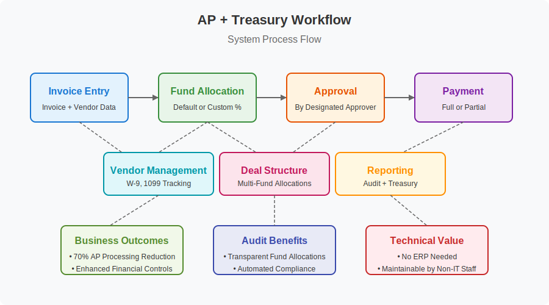
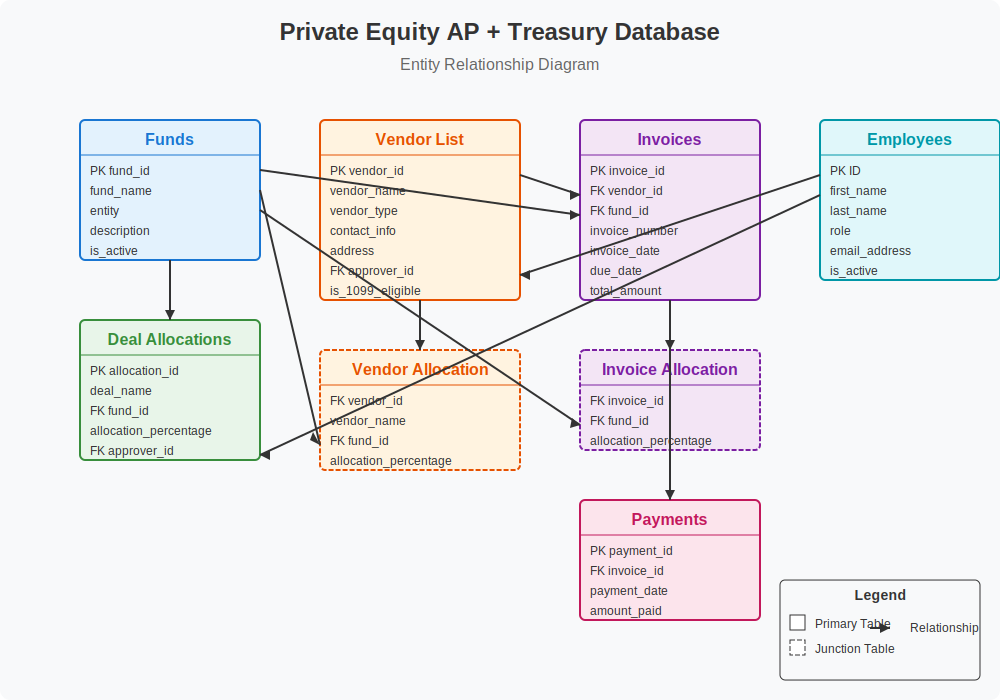

# 🗃️ Private Equity AP + Treasury Access Database System


## 🔍 Overview
This project documents the design, development, and implementation of a custom Accounts Payable and Treasury Operations database system built entirely in Microsoft Access. It was developed to support a private equity firm with 50+ legal entities, spanning both management companies and funds, and operating across 4 different banks.

It was developed as a survival architecture in the absence of an ERP or structured accounting infrastructure — where all workflows were run through Excel, File Explorer, and manually tracked banking activity. This system was created from scratch to serve as the core financial backend for AP processing, fund allocation, vendor management, payment tracking, and audit support.

## 💼 Business Impact
This system provided significant business value:
- **Centralized vendor management** including W-9, 1099 tracking, and payment history.
- **Eliminated manual fund allocation** for multi-entity invoices and vendor payments.
- **Automated approval workflows** with designated approvers by vendor and deal (Note: Approval workflow implementation details like forms/VBA would be part of a full Access application; this repository focuses on schema, queries, and concept).
- **Created audit-ready reporting** for entity-level expenses and disbursements.
- **Reduced AP processing time** by 70%+ through elimination of manual tracking.

| Area             | Impact                                                                                         |
|------------------|------------------------------------------------------------------------------------------------|
| Efficiency       | Reduced AP processing time by structuring invoice intake, fund allocation, and payment workflows |
| Visibility       | Enabled C-suite and Treasury to track vendor payments across complex fund structures           |
| Audit-Readiness  | Created structured data for W-9 tracking, 1099 eligibility, and multi-entity payments        |
| Scalability      | System handles new funds, vendors, and allocations with minimal friction                       |

## 🧠 Key Functional Areas
1.  🔁 **Invoice Lifecycle Tracking**: Tracks the full lifecycle of invoices: from entry, approval, and allocation to payment and reconciliation. Built with multi-fund allocation support, allowing a single invoice to be split across multiple funds. Tracks custom allocation overrides vs. default vendor-to-fund rules.
2.  🧾 **Vendor Management & 1099 Compliance**: Centralized vendor table with fields for contact info, payment terms, W-9 tracking, 1099 eligibility, and active/inactive status. Embedded logic for tracking W-9 submission dates and audit trail compliance.
3.  📊 **Fund and Deal Allocation Engine**: Designed dynamic allocation logic linking deals to funds. Supports default allocation rules, deal-specific allocation overrides, and cross-fund disbursement logic. Enables transparency into how entity-level disbursements relate to fund structure.
4.  💵 **Payment Tracking Module**: Records full and partial payments to vendors, linked back to invoice IDs and fund allocations. Enables reconciliation by invoice or by fund. Designed with audit reporting in mind.
5.  📁 **Audit Reporting Structure**: Schema and queries are optimized to answer critical audit questions (e.g., vendor approvals, fund-specific payments, 1099 status, deal allocations). System designed to support manual audit trails.
6.  🏗️ **Relational Schema Design**: Built a normalized schema with clearly defined one-to-many relationships (Vendors → Invoices, Invoices → Payments, Funds ↔ Deal Allocations, Invoices ↔ Fund Allocations). Indexed tables to optimize performance within Access's constraints.

## 📊 Database Architecture

*(Note: The ERD image `database-erd.svg` should be placed in the `images` folder. A placeholder is used if the actual ERD is not available.)*

The database follows a relational design that connects funds, vendors, invoices, and payments with allocation tables to support complex private equity fund structures.
For detailed table structures and field definitions, please see [DATABASE_SCHEMA.md](./DATABASE_SCHEMA.md).

## 🧱 Core Tables & Relationships
(Refer to [DATABASE_SCHEMA.md](./DATABASE_SCHEMA.md) for full details)

### ✅ Funds & Deal Allocations
- The `Funds` table serves as the central entity catalog for the firm.
- `Deal Allocations` enables assigning deals to multiple funds with percentage splits.
- This relationship supports complex deal structures where investments span multiple entities.

### ✅ Vendor Management
- `Vendor List` maintains master vendor records with tax compliance fields.
- `Vendor Allocation` creates default expense distributions by fund.
- Each vendor can be assigned a designated approver from the `Employees` table.

### ✅ Financial Transactions
- `Invoices` centralizes payables with links to vendors and default funds.
- `Invoice Allocation` enables splitting expenses across multiple funds when needed.
- `Payments` tracks disbursements with support for partial payments.

## 🔧 Database Design Constraints & Solutions

### Challenge: No ERP System
With no enterprise system available, the database needed to support the complex financial operations of a PE firm while remaining maintainable in Microsoft Access.
### Solution:
- Designed focused tables with clear relationships.
- Implemented validation rules for data integrity (within Access UI/VBA, schema provided here).
- Created forms for user-friendly data entry (conceptual, forms not included in this repo).
- Developed reports for financial oversight (queries provided, Access reports to be built on top).

### Challenge: Multi-Fund Deal Structures
Private equity deals often involve multiple funds with complex allocation requirements.
### Solution:
- Junction tables (`Deal Allocations`, `Vendor Allocation`, `Invoice Allocation`).
- Percentage-based allocation system.
- Default distributions with override capabilities.

### Challenge: Audit Requirements
PE firms face strict audit requirements for fund expenses and investment tracking.
### Solution:
- Complete transaction history with approval tracking (schema supports this).
- Entity-level expense visibility.
- Tax compliance fields (W-9 tracking, 1099 eligibility).
- Consistent allocation logic with audit trails.

## 📖 How to Understand the Database Schema
To get a comprehensive understanding of this system:
1.  **Review this README.md file**: It provides a high-level overview, business context, and functional areas.
2.  **Examine the Entity Relationship Diagram (ERD)**: The `images/database-erd.svg` file (if available) visually represents table relationships.
3.  **Study the Detailed Schema**: The [DATABASE_SCHEMA.md](./DATABASE_SCHEMA.md) file contains definitions for all tables, fields, types, and indexes.
4.  **Explore the Sample SQL Queries**: The `sql/sample-queries.sql` file demonstrates practical data retrieval and reporting logic.
5.  **Review VBA Business Logic**: The `src/database-functions.vba` file (placeholder) is intended for custom VBA functions that would drive forms and business rules in a full Access application.

## 🛠️ Working with Microsoft Access
This system was built using Microsoft Access. If you want to implement a similar system:

### Prerequisites
- Microsoft Access (part of Microsoft Office, version 2016+ recommended).
- Basic understanding of relational database concepts.
- Familiarity with SQL queries and VBA programming (for customization and building a front-end).

### Implementation Steps
1.  **Create a new Access database**:
    *   Open Microsoft Access.
    *   Select "Blank database".
    *   Name your database and click "Create".
2.  **Define the database schema**:
    *   Create tables with the field definitions as shown in [DATABASE_SCHEMA.md](./DATABASE_SCHEMA.md).
    *   Set the primary keys and indexes as specified.
    *   Establish relationships between tables (one-to-many, many-to-many) using the Access interface, guided by the schema.
3.  **Import/Implement Business Logic**:
    *   Open the VBA editor (Alt+F11).
    *   Create new modules.
    *   If VBA code is provided (e.g., in `src/database-functions.vba`), copy it into your modules. Otherwise, you'll need to develop VBA for forms, validation, and custom workflows.
4.  **Create forms for data entry**:
    *   Build forms for vendors, invoices, payments, funds, etc., using Access form designer.
    *   Add validation rules and lookups.
    *   Implement business logic using VBA functions.
5.  **Set up reporting**:
    *   Create queries based on the samples in `sql/sample-queries.sql` or write new ones.
    *   Design reports in Access to visualize the data.
    *   Consider implementing dashboards for financial oversight.

## 🧠 Sample Queries
This repository includes a collection of sample SQL queries in `sql/sample-queries.sql` designed for Microsoft Access. These queries cover common reporting needs such as tax compliance, fund allocation, and payables aging.

Here are a couple of examples (see the `.sql` file for more):

### Vendor Tax Compliance Report
```sql
SELECT
    v.vendor_name,
    v.is_1099_eligible,
    v.[W-9],
    v.[Date W-9 submitted],
    Sum(p.amount_paid) AS YTD_Payments
FROM
    [vendor list] v
LEFT JOIN
    Invoices i ON v.vendor_id = i.vendor_id
LEFT JOIN
    payments p ON i.invoice_id = p.invoice_id
WHERE
    Year(p.payment_date) = Year(Date())
    AND v.is_1099_eligible = True
GROUP BY
    v.vendor_name, v.is_1099_eligible, v.[W-9], v.[Date W-9 submitted]
HAVING
    Sum(p.amount_paid) > 600
ORDER BY
    v.vendor_name;
```

### Fund Expense Allocation
```sql
SELECT
    f.fund_name,
    f.entity,
    ia.allocation_percentage,
    (i.total_amount * ia.allocation_percentage / 100) AS Allocated_Amount,
    i.invoice_number,
    i.invoice_date,
    v.vendor_name
FROM
    Funds f
INNER JOIN
    [Invoice allocation] ia ON f.fund_id = ia.fund_id
INNER JOIN
    Invoices i ON ia.invoice_id = i.invoice_id
INNER JOIN
    [vendor list] v ON i.vendor_id = v.vendor_id
WHERE
    i.invoice_date BETWEEN #1/1/2023# AND #12/31/2023#  -- Example date range
ORDER BY
    f.fund_name, i.invoice_date;
```
For the full list and more complex examples, please refer to [sql/sample-queries.sql](./sql/sample-queries.sql).

## 💻 Technical Specifications & Components
- **Database System**: Microsoft Access (2016+)
- **Schema Design**: Normalized to reduce redundancy, with defined relationships and indexing.
- **Tables**: 10+ normalized tables (see [DATABASE_SCHEMA.md](./DATABASE_SCHEMA.md)).
- **Front-End**: Intended for Access forms and reports (not included in this repository, to be built by the user).
- **Reporting**: Custom SQL queries (see `sql/sample-queries.sql`) and Access reports (to be built by the user).
- **Business Logic**: Placeholder for VBA in `src/database-functions.vba`.
- **Constraints**: Primary/foreign keys, validation rules (to be implemented in Access UI/VBA), indexes.

## 📘 Database Field Type Reference
The database schema uses the following Microsoft Access data types. The `Type Code` corresponds to the DAO `DataTypeEnum`.

| Type Code | Access Data Type | Description                |
|-----------|------------------|----------------------------|
| 1         | Yes/No           | Boolean values (True/False)|
| 3         | Integer          | Whole numbers              |
| 4         | Long Integer     | Larger whole numbers       |
| 5         | Double           | Floating-point numbers     |
| 7         | Float            | Floating-point numbers     |  *(Note: In Access, Float is often synonymous with Double for DAO type 7. Size 8 typically indicates Double)*
| 8         | Date/Time        | Date and time values       |
| 10        | Text             | Character strings          |
| 12        | Memo / Long Text | Long text fields           |

*(Size attribute in the schema details refers to field size for text, or precision for numeric types as applicable in Access context).*

## 🔐 Security Considerations
When implementing this system in Microsoft Access:
- **Set appropriate user permissions**: If using Access in a shared environment, explore user-level security (though complex and deprecated in newer ACCDB formats) or rely on file system permissions. For sensitive data, consider splitting the database (front-end/back-end).
- **Implement form-level validation**: Ensure data integrity through robust validation rules on Access forms and in VBA.
- **Create regular backup routines**: Essential for data protection.
- **Consider encrypting sensitive data**: Access provides database password encryption. For field-level, custom solutions may be needed.
- **Implement audit logging for critical operations**: Can be achieved through VBA event handlers writing to an audit log table.

## 📚 Additional Resources
For more information on Microsoft Access database development:
- [Microsoft Access Documentation](https://docs.microsoft.com/en-us/office/access/)
- [Access VBA Reference](https://docs.microsoft.com/en-us/office/vba/api/overview/access)
- [SQL Reference for Access](https://docs.microsoft.com/en-us/office/client-developer/access/desktop-database-reference/microsoft-access-sql-reference)

## 🌟 Personal Contribution
- Reverse-engineered treasury and AP workflows in a high-stakes private equity environment without ERP access.
- Built this system solo, with no admin access, no training, and no technical support.
- Learned fund structure and AP operations from scratch and built tools that outperformed what existed.

## 🎯 Summary
This database project showcases the ability to design and implement practical financial systems within significant constraints. By understanding the complex fund structures and operational requirements of private equity, a solution was created that bridged the gap between Excel-based manual processes and enterprise ERP systems.

The resulting system design aims to provide immediate business value through improved data integrity, streamlined workflows, and enhanced reporting capabilities while supporting strict audit requirements. This repository serves as a blueprint and toolkit for such an implementation. 
